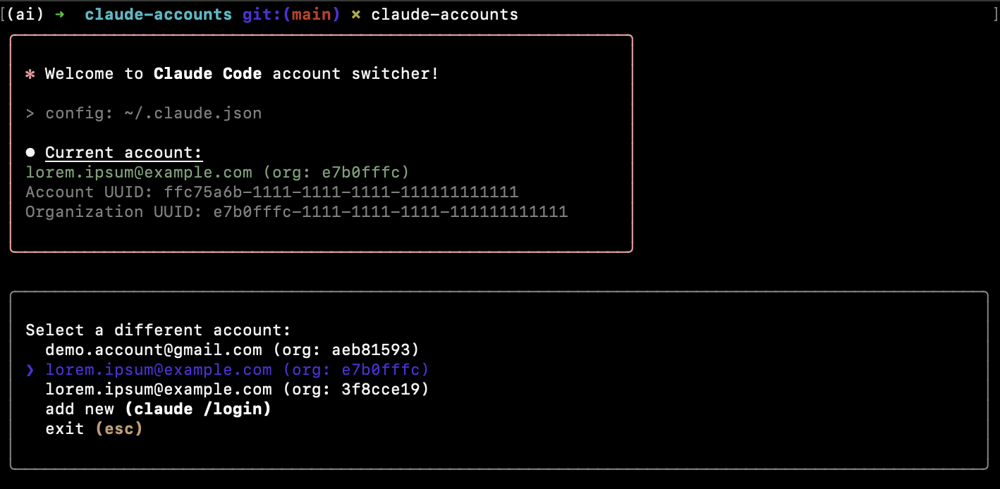
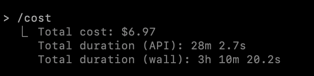

# claude-accounts

[](https://docs.anthropic.com/en/docs/agents-and-tools/claude-code/overview) [](https://x.com/karpathy/status/1886192184808149383)


Switch between multiple accounts for Claude Code cli.

Easily switch between multiple Claude Code accounts without losing your previous account settings. Perfect for developers who need to manage both personal and work accounts.

## Install

```bash
$ npm install --global claude-accounts
```



## Usage

```bash
$ claude-accounts

Current account:
lorem.ipsum@example.com (org: e7b0fffc)

Select a different account:
  demo.account@gmail.com (org: aeb81593)
❯ lorem.ipsum@example.com (org: e7b0fffc)
  lorem.ipsum@example.com (org: 3f8cce19)
  add new (claude /login)
  exit (esc) 
```

Account configuration can be found and edited in `~/.claude.json` under the `__ext__accounts` property.

## Built with Claude Code

Built entirely by [vibe coding](https://x.com/karpathy/status/1886192184808149383) with [Claude Code](https://docs.anthropic.com/en/docs/agents-and-tools/claude-code/overview)

No human slop, all code generated by 🤖

Using the lovely [ink](https://github.com/vadimdemedes/ink) React cli component library.


